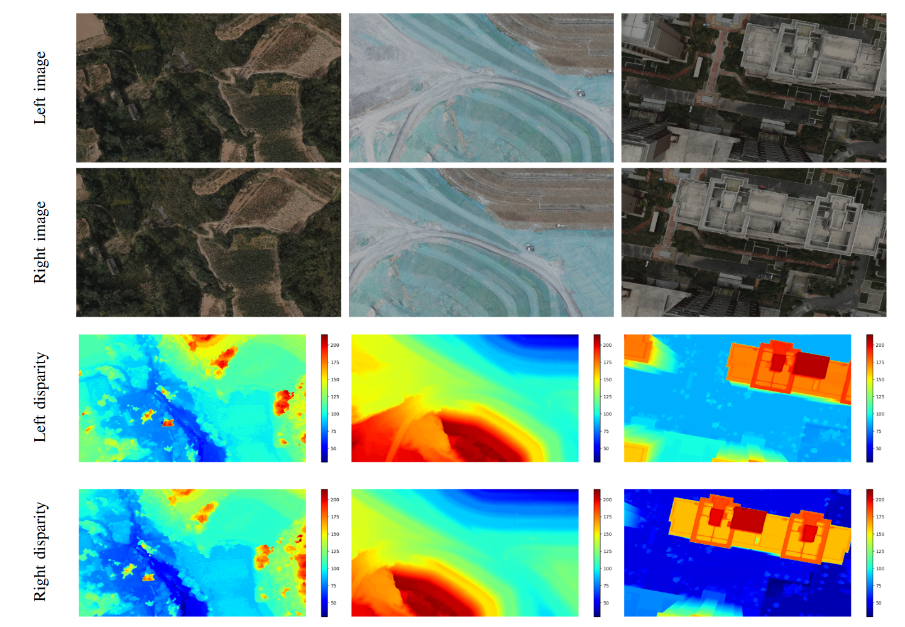

# UAVStereo
[UAVStereo](https://ieeexplore.ieee.org/document/10070843) is a multiple resolution dataset for stereo matching in UAV scenarios. The dataset provides multi-resolution and multi-scene image pairs to accommodate various sensors and environments.

## Download 
Coming soon!

## Scenes

Three different scenarios were included in the UAVStereo dataset: residential land, forest, and mining areas.

The residential area contains dense and regular tall buildings, flat roadways, and other urban scene features. This area provides an urban scene with disparity saltation, such as buildings. 


The forest area contains high-coverage trees, several houses, and other field scene components. This region has textureless and repeated-texture images, which presents difficulties for stereo-matching algorithms.


The mining zone is composed of agriculture, low structures, and bare ground, which contain a continuous variation of disparity.


These three areas are representative areas for UAV Earth observations and can represent different disparity distributions.

## Samples



## Dataset Structure

```

Data root
|-Forest
|-Mining
|-Residential
    |--train
    |--test
        |---Eights(960*540px)
        |---Quarters(1960*1080px)
        |---Half(3840*2160px)
            |----**-Baseline-15
            |----**-Baseline-16
             ...
            |----**-Baseline-35
                      |-----ImageLeft
                              |------000*_L.png
                              ...
                      |-----ImageRight
                              |------000*_R.png
                              ...
                      |-----DispLeft
                              |------000*_L.pfm
                              ...
                      |-----DispRight
                              |------000*_R.pfm
                              ...
 
```
